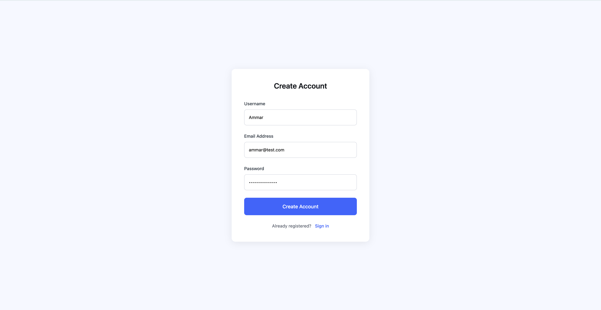
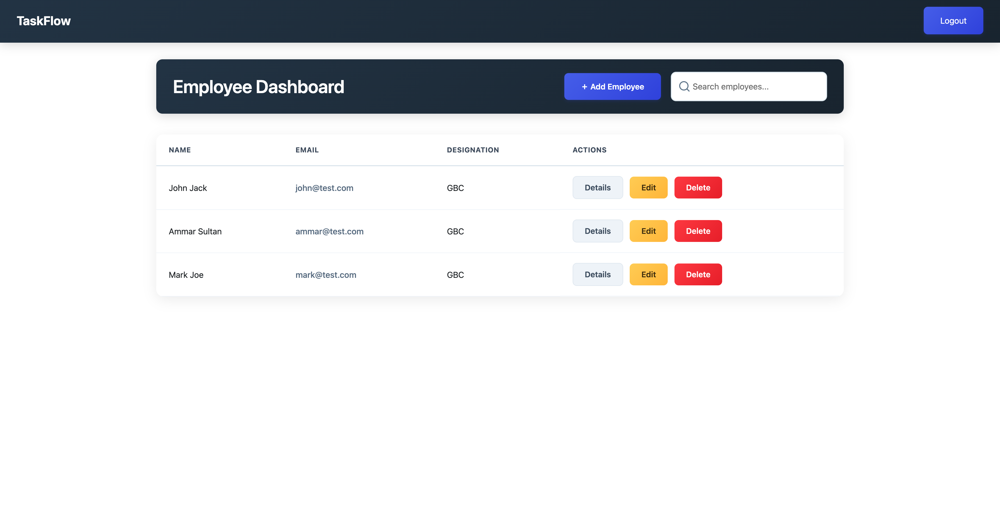
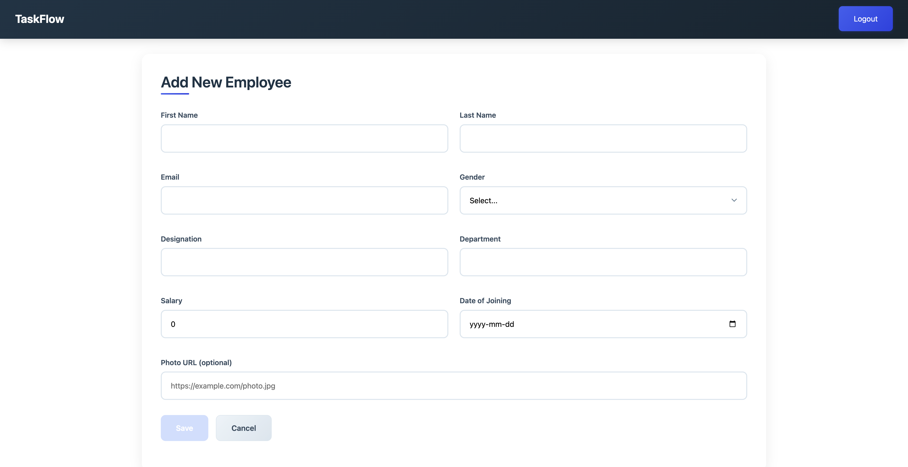
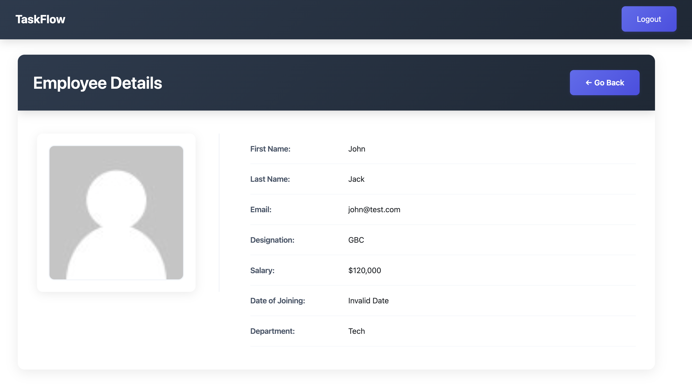
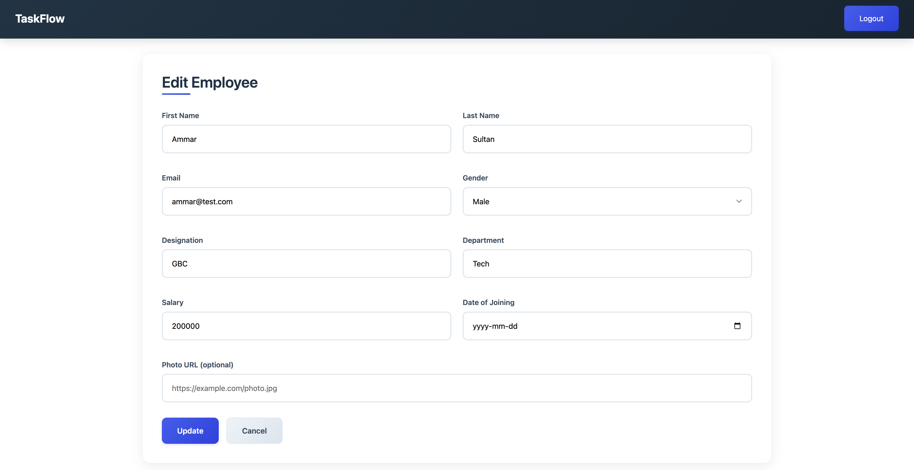

# Employee Management System - COMP 3133

### Overview

This project is an Employee Management System developed using Angular and GraphQL. It provides functionality for managing employee data through a user-friendly interface.

### Screenshots

1. Login Screen  
   

2. Signup Screen  
   

3. Employee List  
   

4. Add Employee Form  
   

5. View Employee Details  
   

6. Edit Employee Details  
   

### Features

- **Login & Signup:** Custom-designed authentication screens to securely log in or register users.
- **Session Management:** Maintains session using HTML local storage.
- **Employee List:** Displays a list of all employees with relevant details.
- **Add Employee:** Allows users to add a new employee using a simple form and API integration.
- **View Employee:** Shows detailed information of a selected employee.
- **Update Employee:** Enables users to update existing employee information.
- **Delete Employee:** Allows the removal of an employee from the system.
- **Logout:** Redirects to the login page, clearing the session.

### Technologies Used

- Angular for frontend development
- GraphQL for data fetching and manipulation
- Angular Material for responsive UI
- HTML local storage for session management

## Deployment

The application is deployed on cloud hosting platforms for both the frontend and backend.

- **Frontend:** [Netlify Deployment](https://101296759-assignment2.netlify.app/)
- **Backend (GraphQL Server):** [Render Deployment](https://one01296759-comp3133-assignment2.onrender.com/graphql)

These URLs can be used to access and test the application in a production environment.

### How to Run

1. Clone the repository from GitHub.
2. Navigate to the project directory and install dependencies using:
   ```bash
   npm install
   ```
3. Start the application with:
   ```bash
   ng serve
   ```
4. Open the application in a browser at:
   ```
   http://localhost:4200
   ```
